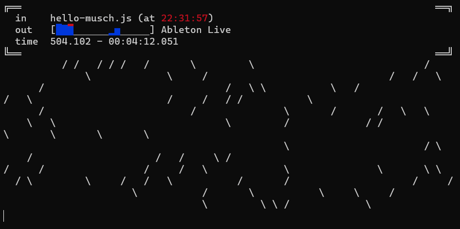

# Musch 0.0.1

A tiny environment for musical composition and live-coding in JavaScript.



## Quick start

To run from the sources:

- clone the project
- install the NPM dependencies with `npm ci`
- install the command-line runner with `npm install -g .`
- run with `musch`

You'll be prompted a text file to read from, and a MIDI output to send to.

Every change to the text file will trigger the execution of its content,
allowing on-the-fly modification of the program running.

## Example program

Here is a simple program that demonstrates the API basics :

```javascript
// Log some text
log('Hello, World!');

// Play a MIDI note with note number 36, velocity 127, and duration 1
note(36, 127, 1);

// Offset time cursor
wait(2);

// `flog` logs to the console at the current cursor position
// `cursor` returns the current cursor position
flog('Waited for 2. Now is ' + cursor());

// Play another MIDI note 2 seconds after the first one
// The fourth argument (optional) is the MIDI channel
note(40, 127, 1, 1);

// Move time cursor 1 second after current clock position
// Try saving the program to trigger the following instructions again
at(now() + 1);
flog('1 second after now');

// Moves the cursor to the next multiple of 4
next(4);

// Repeat an action 5 times every 0.25 seconds
repeat(0.25, (i) => log('Repeat #' + i), 5);

// Sets the default MIDI channel to 9 for subsequent calls to `note` without a channel argument
channel(9);
```

## CLI documentation

See [CLI documentation](https://pckerneis.github.io/musch/#/cli.md).

## API reference

See also [API reference](https://pckerneis.github.io/musch/#/api-reference.md).

<a name="define"></a>

### define(name, [defaultValue]) ⇒ <code>\*</code>
Define variable in the execution context with an optional default value.
This won't have any effects if a value is already defined for `name`.

**Kind**: global function  
**Returns**: <code>\*</code> - the named value  

| Param | Type | Description |
| --- | --- | --- |
| name | <code>string</code> | The accessor name |
| [defaultValue] | <code>\*</code> | A default value |

<a name="set"></a>

### set(name, value)
Define or overwrite variable in the execution context with the provided value.
This won't have any effects if a value is already defined for `name`.

**Kind**: global function  

| Param | Type | Description |
| --- | --- | --- |
| name | <code>string</code> | The accessor name |
| value | <code>\*</code> | new value |

<a name="clear"></a>

### clear()
Clears the logs.

**Kind**: global function  
<a name="fclear"></a>

### fclear()
Schedule a log clear at the cursor position.

**Kind**: global function  
<a name="log"></a>

### log(messages)
Log messages tout console output.

**Kind**: global function  

| Param | Type | Description |
| --- | --- | --- |
| messages | <code>\*</code> | Messages to log |

<a name="flog"></a>

### flog(messages)
Schedule messages to be logged at the cursor position.

**Kind**: global function  

| Param | Type | Description |
| --- | --- | --- |
| messages | <code>\*</code> | Messages to log |

<a name="note"></a>

### note(pitch, velocity, duration, [channel])
Schedule a MIDI note to be played at the cursor position
with note number `pitch`, velocity `velocity` and duration `duration` on MIDI channel `channel`.

**Kind**: global function  

| Param | Type | Description |
| --- | --- | --- |
| pitch | <code>number</code> | MIDI note number |
| velocity | <code>number</code> | Velocity value |
| duration | <code>number</code> | Note duration |
| [channel] | <code>number</code> | MIDI channel to send to |

<a name="program"></a>

### program(program, [channel])
Sends a MIDI program change message.

**Kind**: global function  

| Param | Type | Description |
| --- | --- | --- |
| program | <code>number</code> | MIDI program number |
| [channel] | <code>number</code> | MIDI channel to send to |

<a name="cc"></a>

### cc(controller, value, [channel])
Sends a MIDI continuous controller message.

**Kind**: global function  

| Param | Type | Description |
| --- | --- | --- |
| controller | <code>number</code> | MIDI program number |
| value | <code>number</code> | new value |
| [channel] | <code>number</code> | MIDI channel to send to |

<a name="channel"></a>

### channel([channelNumber])
Set the default value for next MIDI messages

**Kind**: global function  

| Param | Type | Description |
| --- | --- | --- |
| [channelNumber] | <code>number</code> | Default MIDI channel |

<a name="setSeed"></a>

### setSeed(seed)
Sets the seed for the random number generator

**Kind**: global function  

| Param | Type | Description |
| --- | --- | --- |
| seed | <code>\*</code> | the seed to use |

<a name="random"></a>

### random([min], [max]) ⇒ <code>number</code>
Returns a random number between 0 and 1 with optional min and max values.
If both min and max are specified, the returned number will be between min and max.
If only min is specified, the returned number will be between 0 and min.

**Kind**: global function  
**Returns**: <code>number</code> - a random number between 0 and 1  

| Param | Type | Description |
| --- | --- | --- |
| [min] | <code>number</code> | if both arguments are numbers, the minimum value of the random number, else the maximum value |
| [max] | <code>number</code> | if specified, the maximum value of the random number |

<a name="now"></a>

### now() ⇒ <code>number</code>
Returns the execution time

**Kind**: global function  
**Returns**: <code>number</code> - Current execution time  
<a name="cursor"></a>

### cursor() ⇒ <code>number</code>
Returns the current time cursor position

**Kind**: global function  
**Returns**: <code>number</code> - the cursor position  
<a name="fire"></a>

### fire(action)
Schedule the function `action` to be called at the cursor position.

**Kind**: global function  

| Param | Type | Description |
| --- | --- | --- |
| action | <code>function</code> \| <code>string</code> | The action to schedule as a function or a key |

<a name="repeat"></a>

### repeat(interval, action, count)
Repeatedly calls the function `action` every `interval`, `count` times, starting at the cursor position.

**Kind**: global function  

| Param | Type | Description |
| --- | --- | --- |
| interval | <code>number</code> | The repeat interval as a strictly positive number |
| action | <code>function</code> \| <code>string</code> | The action to repeat as a function or a key |
| count | <code>number</code> | How many times to repeat. Defaults to Infinity. |

<a name="at"></a>

### at(time)
Move the cursor at position `time`.

**Kind**: global function  

| Param | Type | Description |
| --- | --- | --- |
| time | <code>number</code> | Time position to move the cursor to |

<a name="wait"></a>

### wait(duration)
Offset the cursor by `duration`.

**Kind**: global function  

| Param | Type | Description |
| --- | --- | --- |
| duration | <code>number</code> | Duration to move the cursor by |

<a name="setSpeed"></a>

### setSpeed(newSpeed)
Sets the scheduler's playback speed. Defaults to 1.
`newSpeed` must be a strictly positive number, or the function call won't have
any effect.
If speed is set to 2, time will tick twice as fast. This is useful for defining
a global tempo value.

**Kind**: global function  

| Param | Type | Description |
| --- | --- | --- |
| newSpeed | <code>number</code> | The new speed value |

<a name="getSpeed"></a>

### getSpeed() ⇒ <code>number</code>
Returns the current scheduler's playback speed.

**Kind**: global function  
<a name="speed"></a>

### speed([newSpeed]) ⇒ <code>number</code>
Shortcut for setting and getting scheduler's playback speed.

**Kind**: global function  
**Returns**: <code>number</code> - Scheduler playback speed after eventual modification  

| Param | Type | Description |
| --- | --- | --- |
| [newSpeed] | <code>number</code> | New speed value. If you pass null, undefined or omit the value, the scheduler's speed won't change. |

<a name="next"></a>

### next(interval)
Moves the cursor to the next multiple of `interval`.

**Kind**: global function  

| Param | Description |
| --- | --- |
| interval | Time interval |

<a name="stepper"></a>

### stepper(pattern, handler, [continuation], [silence]) ⇒ [<code>Stepper</code>](#Stepper)
Creates a stepper object

**Kind**: global function  
**Returns**: [<code>Stepper</code>](#Stepper) - the stepper object  

| Param | Type | Default | Description |
| --- | --- | --- | --- |
| pattern | <code>string</code> |  | The pattern to play |
| handler | [<code>StepHandler</code>](#StepHandler) |  | A function to be called for each step |
| [continuation] | <code>string</code> | <code>&quot;&#x27;~&#x27;&quot;</code> | The step continuation character |
| [silence] | <code>string</code> | <code>&quot;&#x27;_&#x27;&quot;</code> | The step silence character |

<a name="pick"></a>

### pick([numberOrArrayOrElements]) ⇒ <code>\*</code>
Pick an element among choices.
- If an array is provided, the output will be an element of the array
- If an string is provided, the output will be a character of the string
- If a number is provided, the output will be a number between 0 and this number
- For other inputs, the output is a random value between 0 and 1

**Kind**: global function  
**Returns**: <code>\*</code> - a randomly picked element  

| Param | Type | Description |
| --- | --- | --- |
| [numberOrArrayOrElements] | <code>Array</code> | choices to pick from as a number, an array or a string |

<a name="iter"></a>

### iter(iterableOrNumber, callback)
For each element of `iterableOrNumber`, call a function `callback`.
It can iterate over an iterable (such as an Array or a string) or on positive
integers starting from zero.

**Kind**: global function  

| Param |
| --- |
| iterableOrNumber | 
| callback | 

<a name="ring"></a>

### ring(...elements) ⇒ [<code>Ring</code>](#Ring)
Creates a Ring.

**Kind**: global function  
**Returns**: [<code>Ring</code>](#Ring) - a Ring containing `elements`.  

| Param | Type | Description |
| --- | --- | --- |
| ...elements | <code>\*</code> | Elements to circle through |

<a name="Stepper"></a>

### Stepper : <code>Object</code>
**Kind**: global typedef  
**Properties**

| Name | Type | Description |
| --- | --- | --- |
| at | <code>function</code> | Calls the handler function for the given step index |

<a name="StepHandlerParameters"></a>

### StepHandlerParameters : <code>Object</code>
**Kind**: global typedef  
**Properties**

| Name | Type | Description |
| --- | --- | --- |
| duration | <code>number</code> | The duration of the step |
| symbol | <code>string</code> \| <code>number</code> | The symbol of the step as a number (integer) or a string (character) |
| line | <code>number</code> | The line of the step |

<a name="StepHandler"></a>

### StepHandler : <code>function</code>
**Kind**: global typedef  

| Param | Type | Description |
| --- | --- | --- |
| step | [<code>StepHandlerParameters</code>](#StepHandlerParameters) | The step object |

<a name="Ring"></a>

### Ring
**Kind**: global typedef  
**Properties**

| Name | Type | Description |
| --- | --- | --- |
| elements | <code>Array</code> | return the elements array. |
| get | <code>function</code> | return an element at given position. |
| move | <code>function</code> | moves cursor at given position and return the pointed element. |
| next | <code>function</code> | advance cursor and return the next element of the Ring. |
| peek | <code>function</code> | return the currently pointed element of the Ring. |

