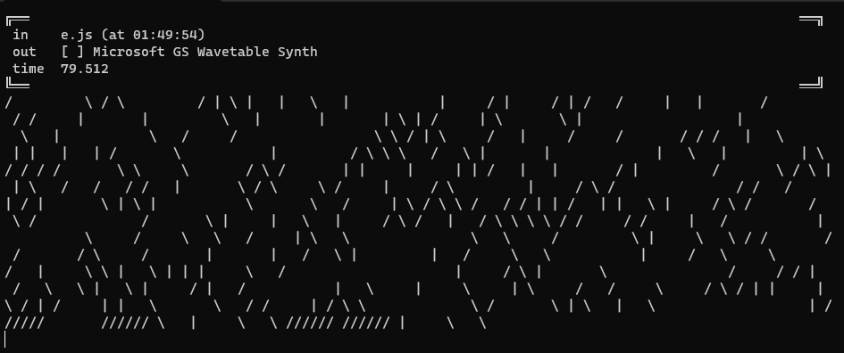

# fwd 0.0.1

A tiny environment for musical composition and live-coding in JavaScript.



## Quick start

To run from the sources:

- clone the project
- install the NPM dependencies with `npm ci`
- install the command-line runner with `npm install -g .`
- run with `fwd`

You'll be prompted a text file to read from, and a MIDI output to send to.

Every change to the text file will trigger the execution of its content,
allowing on-the-fly modification of the program running.

## Example program

Here is a simple program that demonstrates the API basics :

```javascript
// Log some text
log('Hello, World!');

// Play a MIDI note
note(36, 127, 1);

// Offset time cursor
wait(2);
flog('Waited for 2. Now is ' + cursor());
note(40, 127, 1);

// Move time cursor after current clock position.
// Try changing the program to trigger these instructions again
at(now() + 1);
flog('1 second after now');

at(3);
repeat(0.25, (i) => log('Repeat #' + i), 5);
```

## CLI documentation

See [CLI documentation](cli.md).

## API reference

See also [API reference](api-reference.md).

<a name="define"></a>

### define(name, [defaultValue]) ⇒ <code>\*</code>
Define variable in the execution context with an optional default value.
This won't have any effects if a value is already defined for `name`.

**Kind**: global function  
**Returns**: <code>\*</code> - the named value  

| Param | Type | Description |
| --- | --- | --- |
| name | <code>string</code> | The accessor name |
| [defaultValue] | <code>\*</code> | A default value |

<a name="set"></a>

### set(name, value)
Define or overwrite variable in the execution context with the provided value.
This won't have any effects if a value is already defined for `name`.

**Kind**: global function  

| Param | Type | Description |
| --- | --- | --- |
| name | <code>string</code> | The accessor name |
| value | <code>\*</code> | new value |

<a name="clear"></a>

### clear()
Clears the logs.

**Kind**: global function  
<a name="fclear"></a>

### fclear()
Schedule a log clear at the cursor position.

**Kind**: global function  
<a name="log"></a>

### log(messages)
Log messages tout console output.

**Kind**: global function  

| Param | Type | Description |
| --- | --- | --- |
| messages | <code>\*</code> | Messages to log |

<a name="flog"></a>

### flog(messages)
Schedule messages to be logged at the cursor position.

**Kind**: global function  

| Param | Type | Description |
| --- | --- | --- |
| messages | <code>\*</code> | Messages to log |

<a name="note"></a>

### note(pitch, velocity, duration, [channel])
Schedule a MIDI note to be played at the cursor position
with note number `pitch`, velocity `velocity` and duration `duration` on MIDI channel `channel`.

**Kind**: global function  

| Param | Type | Description |
| --- | --- | --- |
| pitch | <code>number</code> | MIDI note number |
| velocity | <code>number</code> | Velocity value |
| duration | <code>number</code> | Note duration |
| [channel] | <code>number</code> | MIDI channel to send to |

<a name="program"></a>

### program(program, [channel])
Sends a MIDI program change message.

**Kind**: global function  

| Param | Type | Description |
| --- | --- | --- |
| program | <code>number</code> | MIDI program number |
| [channel] | <code>number</code> | MIDI channel to send to |

<a name="cc"></a>

### cc(controller, value, [channel])
Sends a MIDI continuous controller message.

**Kind**: global function  

| Param | Type | Description |
| --- | --- | --- |
| controller | <code>number</code> | MIDI program number |
| value | <code>number</code> | new value |
| [channel] | <code>number</code> | MIDI channel to send to |

<a name="channel"></a>

### channel([channelNumber])
Set the default value for next MIDI messages

**Kind**: global function  

| Param | Type | Description |
| --- | --- | --- |
| [channelNumber] | <code>number</code> | Default MIDI channel |

<a name="now"></a>

### now() ⇒ <code>number</code>
Returns the execution time

**Kind**: global function  
**Returns**: <code>number</code> - Current execution time  
<a name="cursor"></a>

### cursor() ⇒ <code>number</code>
Returns the current time cursor position

**Kind**: global function  
**Returns**: <code>number</code> - the cursor position  
<a name="resetCursor"></a>

### resetCursor()
Reset the cursor to 0

**Kind**: global function  
<a name="fire"></a>

### fire(action)
Schedule the function `action` to be called at the cursor position.

**Kind**: global function  

| Param | Type | Description |
| --- | --- | --- |
| action | <code>function</code> | The action to schedule as a function |

<a name="repeat"></a>

### repeat(interval, action, count)
Repeatedly calls the function `action` every `interval` seconds `count` times, starting at the cursor position.

**Kind**: global function  

| Param | Type | Description |
| --- | --- | --- |
| interval | <code>number</code> | The repeat interval as a strictly positive number of seconds |
| action | <code>function</code> | The action to repeat |
| count | <code>number</code> | How many times to repeat. Defaults to Infinity. |

<a name="at"></a>

### at(time)
Move the cursor at position `time` expressed in seconds.

**Kind**: global function  

| Param | Type | Description |
| --- | --- | --- |
| time | <code>number</code> | Time position in seconds |

<a name="wait"></a>

### wait(duration)
Offset the cursor by `duration` expressed in seconds.

**Kind**: global function  

| Param | Type | Description |
| --- | --- | --- |
| duration | <code>number</code> | Duration in seconds |

<a name="setSpeed"></a>

### setSpeed(newSpeed)
Sets the scheduler's playback speed. Defaults to 1.
`newSpeed` must be a strictly positive number, or the function call won't have
any effect.
If speed is set to 2, time will tick twice as fast. This is useful for defining
a global tempo value.

**Kind**: global function  

| Param | Type | Description |
| --- | --- | --- |
| newSpeed | <code>number</code> | The new speed value |

<a name="getSpeed"></a>

### getSpeed() ⇒ <code>number</code>
Returns the current scheduler's playback speed.

**Kind**: global function  
<a name="pick"></a>

### pick([numberOrArrayOrElements]) ⇒ <code>\*</code>
Pick an element among choices.
- If an array is provided, the output will be an element of the array
- If an string is provided, the output will be a character of the string
- If a number is provided, the output will be a number between 0 and this number
- For other inputs, the output is a random value between 0 and 1

**Kind**: global function  
**Returns**: <code>\*</code> - a randomly picked element  

| Param | Type | Description |
| --- | --- | --- |
| [numberOrArrayOrElements] | <code>Array</code> | choices to pick from as a number, an array or a string |

<a name="iter"></a>

### iter(iterableOrNumber, callback)
For each element of `iterableOrNumber`, call a function `callback`.
It can iterate over an iterable (such as an Array or a string) or on positive
integers starting from zero.

**Kind**: global function  

| Param |
| --- |
| iterableOrNumber | 
| callback | 

<a name="ring"></a>

### ring(...elements) ⇒ [<code>Ring</code>](#Ring)
Creates a Ring.

**Kind**: global function  
**Returns**: [<code>Ring</code>](#Ring) - a Ring containing `elements`.  

| Param | Type | Description |
| --- | --- | --- |
| ...elements | <code>\*</code> | Elements to circle through |

<a name="Ring"></a>

### Ring
**Kind**: global typedef  
**Properties**

| Name | Type | Description |
| --- | --- | --- |
| next | <code>function</code> | advance and return the next element of the Ring. |
| peek | <code>function</code> | return the current element of the Ring. |

